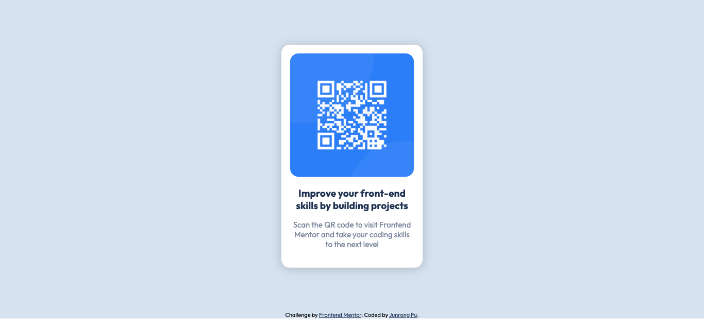

# Frontend Mentor - QR code component solution

This is a solution to the [QR code component challenge on Frontend Mentor](https://www.frontendmentor.io/challenges/qr-code-component-iux_sIO_H). Frontend Mentor challenges help you improve your coding skills by building realistic projects.

## Table of contents

-   [Overview](#overview)
    -   [Screenshot](#screenshot)
    -   [Links](#links)
-   [My process](#my-process)
    -   [Built with](#built-with)
    -   [What I learned](#what-i-learned)
    -   [Continued development](#continued-development)
    -   [Useful resources](#useful-resources)
-   [Author](#author)
-   [Acknowledgments](#acknowledgments)

## Overview

### Screenshot



### Links

-   Solution URL: [Add solution URL here](https://your-solution-url.com)
-   Live Site URL: [Add live site URL here](https://your-live-site-url.com)

## My process

### Built with

-   Semantic HTML5 markup
-   CSS custom properties
-   Flexbox
-   CSS Grid
-   Mobile-first workflow

### What I learned

```css
.proud-of-this-css {
    .container {
        height: 100vh;
        display: grid;
        place-items: center;
    }
}
```

### Continued development

No

### Useful resources

-   [MDN](https://developer.mozilla.org/en-US/docs/Web/CSS/box-shadow) - This helped me for setting box-shadow.

## Author

-   Website - [Akira](https://www.your-site.com)
-   Frontend Mentor - [@akirafu](https://www.frontendmentor.io/profile/yourusername)

## Acknowledgments

Definitely is MDN
